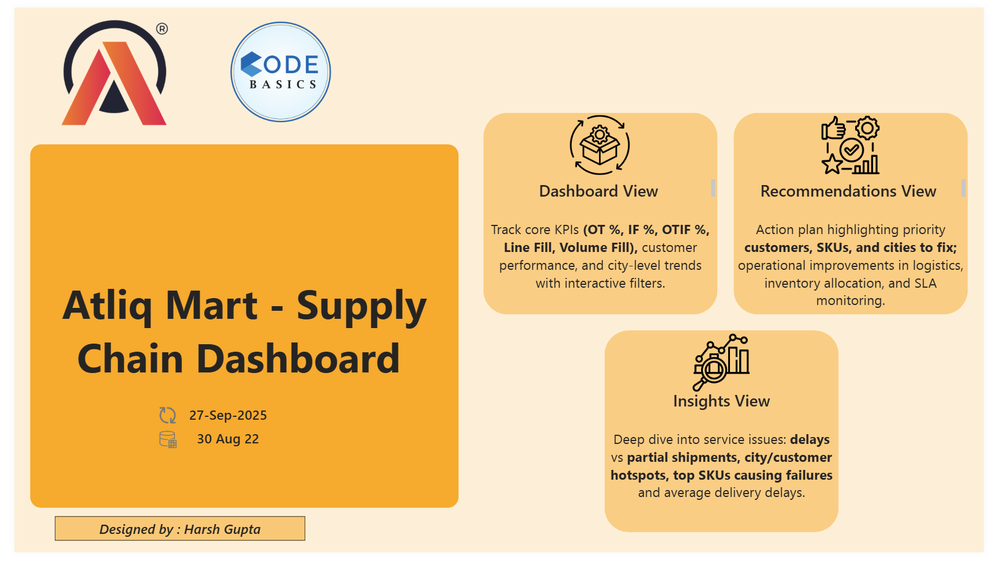
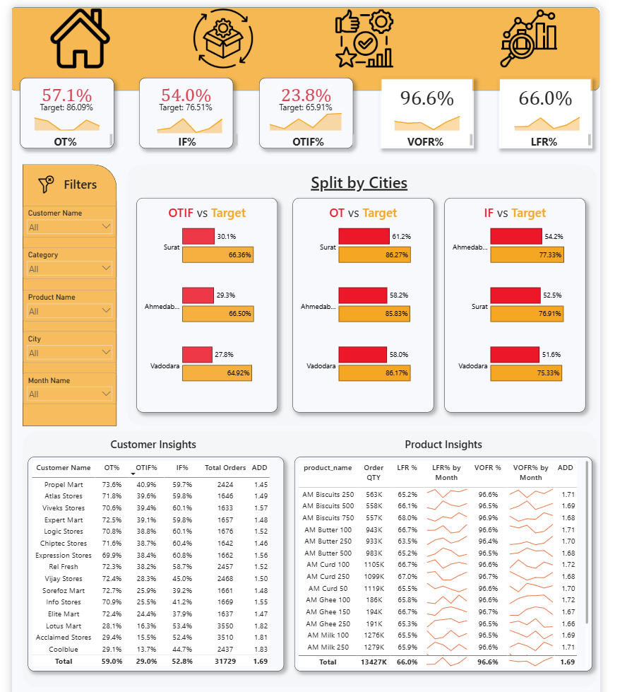
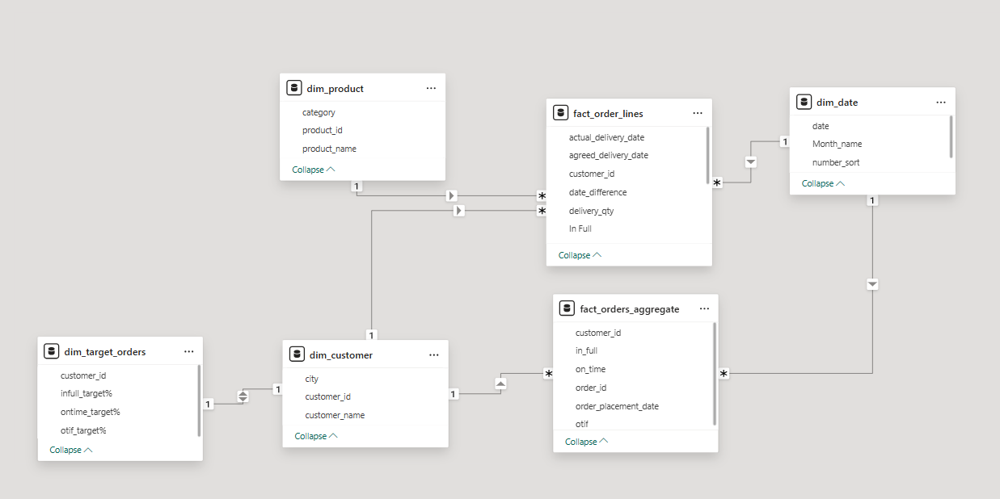

# 🚚 Supply Chain Dashboard – Power BI Project  

## 🏢 Company: AtliQ Mart (Codebasics Resume Project Challenge #5)  
🔗 Challenge Link: [Codebasics Resume Project Challenge #5](https://codebasics.io/challenges/codebasics-resume-project-challenge/5)  

---

## 📌 Project Overview  
AtliQ Mart, an FMCG manufacturer operating in **Surat, Ahmedabad, and Vadodara**, faced service issues causing key customers not to renew contracts. Management suspected late and partial deliveries as root causes.  

This project delivers a **Supply Chain Service Performance Dashboard** to track:  
- **On-Time Delivery % (OT)**  
- **In-Full Delivery % (IF)**  
- **On-Time In-Full % (OTIF)**  
- **Line Fill Rate (LFR)**  
- **Volume Fill Rate (VFR)**  

The dashboard allows management to monitor service KPIs, identify problem customers, cities, and SKUs, and take swift corrective actions before expansion to Tier-1 cities.  

🔗 [Live Dashboard Link](https://app.powerbi.com/view?r=eyJrIjoiZTc2YTQ4ODQtNjk4Ny00YWJhLWExYjctMTNmNjYzY2Y3ZjYxIiwidCI6ImM2ZTU0OWIzLTVmNDUtNDAzMi1hYWU5LWQ0MjQ0ZGM1YjJjNCJ9)  
🔗 [LinkedIn Profile](https://www.linkedin.com/in/harsh-g-analyst/)  

---

## ⚙️ Tech Stack  
- **SQL** → Data extraction and preparation  
- **Power BI Desktop** → Data modeling, dashboard building  
- **Power Query (M)** → Transformations (date diff, data cleaning)  
- **DAX** → KPI measures (OT, IF, OTIF, LFR, VFR, Average Delay)  
- **Excel/CSV** → Source validation  

---

## 🧠 Key Business Concepts  
- **On-Time % (OT):** Orders delivered before/within agreed delivery date  
- **In-Full % (IF):** Orders delivered completely as requested  
- **OTIF %:** Orders delivered both On-Time and In-Full  
- **Line Fill Rate (LFR):** % of order lines fulfilled in full  
- **Volume Fill Rate (VFR):** % of quantity fulfilled vs ordered  

---

## 🧩 Data Model  

  

**Tables Used:**  
- **fact_order_lines** → Order-level details (order id, product, qty, dates, delivered qty)  
- **fact_orders_aggregate** → Order-level flags (on_time, in_full, otif)  
- **dim_customers** → Customer info (id, name, city)  
- **dim_products** → Product info (id, name, category)  
- **dim_date** → Date table (day, week, month, quarter)  
- **dim_targets_orders** → SLA target values for each customer (OT, IF, OTIF)  

---

## 📸 Dashboard Views  

### 🏠 Home Page  
  

### 📊 Dashboard View  
  

### 🔍 Insights View  
  

### ✅ Recommendations View  
  

### 🗂 Data Model  
  

---

## 🎓 Key Learnings & Power BI Features  
- Requirement gathering & business understanding  
- Calculated columns (delivery delays, line fulfillment)  
- DAX measures for KPIs & targets  
- Snowflake data model linking facts & dims  
- Dynamic KPI selection (parameters + SWITCH)  
- Conditional formatting (gap vs target)  
- Sparklines in table visuals  
- Drillthrough for customer/order analysis  
- Home page navigation with bookmarks  

---

## 🎯 Insights & Recommendations  

**Insights:**  
- OTIF below SLA for key customers, major churn risk  
- Ahmedabad city underperforming in OTIF vs Surat/Vadodara  
- Partial shipments (In-Full failures) are main cause of poor OTIF  
- Few SKUs account for majority of failures  
- Average delivery delay: ~2–3 days  

**Recommendations:**  
- Daily alerts for customers with OTIF < target (3+ days)  
- Prioritize fixing Ahmedabad logistics routes  
- Focus on top SKUs driving partial orders  
- Account managers to proactively address at-risk customers  
- Review carrier SLAs and enforce penalties where delays > 2 days  

---

## 📖 Notes  
- Data is for learning/demo purposes only.  
- Project built as part of the **Codebasics Resume Project Challenge #5**.  

---

👤 **Author**: Harsh Gupta  
🔗 [LinkedIn Profile](https://www.linkedin.com/in/harsh-g-analyst/)  
